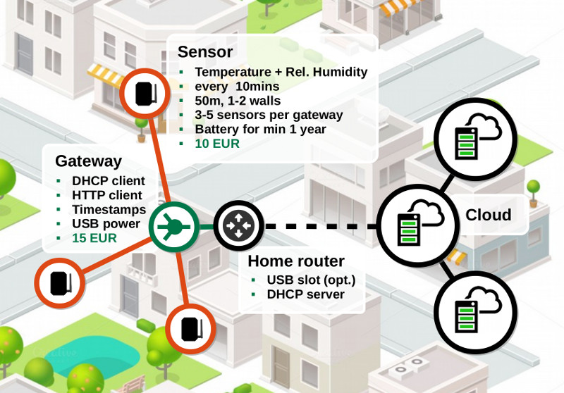

# Weather sensors developed within BigGIS project

The aim is to create a cheap wireless temperature/humidity sensors that can send sensor readings to a cloud through a gateway connected to a home router.

# Basic idea

# Development

[NRF24L01-Howto]: https://arduino-info.wikispaces.com/Nrf24L01-2.4GHz-HowTo

## Gateway

[gw-ortho]: hw/gateway/gw-model-ortho.jpg
[gw-side]:  hw/gateway/gw-model-side.jpg
[gw-front]: hw/gateway/gw-model-front.jpg

 Side view  | Front view  | Orthographic projection
------------|-------------|------------------------
![gw-side]  | ![gw-front] | ![gw-ortho]

- Arduino Nano v3 @5V (MCU with USB-mini connector)
- ENC28J60 (ethernet module, not the same as original Arduino ethernet shield W5100)
- NRF24L01 + PA + LNA (rf module with built-in antenna)
  - 3.3uF to 10uF capacitor (see also [NRF24L01-Howto])

## Sensor

[se-ortho]: hw/sensor/sensor-model-ortho.jpg
[se-side]:  hw/sensor/sensor-model-side.jpg
[se-front]: hw/sensor/sensor-model-front.jpg

 Side view  | Front view  | Orthographic projection
------------|-------------|------------------------
![se-side]  | ![se-front] | ![se-ortho]

- Arduino Pro Mini @3.3V (MCU with low power consumption)
- DHT22 Temperature/Humidity sensor (cheap and accurate)
  - 10K resistor
  - 100nF capacitor
- NRF24L01 + PA + LNA (RF module with built-in antenna)
  - 3.3uF-10uF capacitor (see also [NRF24L01-Howto])
- 10K resistor
- 100nF capacitor for DHT22

## How to contribute
- fork, clone, edit, commit, push, create pull request
- Use Arduino IDE or something similar

## Required Arduino Libraries
- Adafruit DHT sensor library : https://github.com/adafruit/DHT-sensor-library
- UIPEthernet
- nRF24L01p_SoftSPI
